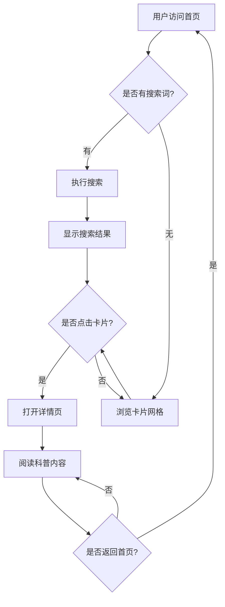

# 城市鸟类科普网页 - 产品需求文档

## 1. 产品概述

一个面向城市居民的自然教育网页，通过精美的游戏卡片界面展示常见城市鸟类的科普知识，帮助用户了解身边的自然生态，提升生态保护意识。网页以沉浸式的视觉体验和流畅的交互设计，让科普学习变得有趣且令人印象深刻。

**核心价值：**
- 将枯燥的科普知识转化为有趣的视觉体验
- 帮助城市居民认识和了解身边的鸟类邻居
- 培养对自然的热爱和保护意识

**目标用户：**
- 对自然和鸟类感兴趣的城市居民
- 自然教育爱好者
- 亲子家庭（儿童自然教育）
- 学生群体

## 2. 核心功能

### 2.1 用户角色

| 角色 | 说明 | 核心功能 |
|------|------|----------|
| 访客用户 | 任意访问者 | 浏览鸟类卡片、查看科普详情、搜索筛选 |

### 2.2 功能模块

1. **首页卡片展示区**：以游戏卡片网格展示多种城市鸟类
2. **鸟类详情页面**：点击卡片进入详情，展示完整科普信息
3. **分类筛选功能**：按鸟类特征（食性、栖息环境等）筛选
4. **搜索功能**：通过名称快速查找鸟类
5. **响应式设计**：适配桌面端和移动端设备

### 2.3 页面详情

#### 首页 - 鸟类卡片展示页
| 模块 | 功能描述 |
|------|----------|
| 导航栏 | Logo、网页标题、搜索框、筛选按钮 |
| Hero区域 | 动态背景、欢迎语、引导性标语 |
| 卡片网格 | 展示鸟类卡片，每张卡片包含：图片、名称、英文名、特征标签 |
| 卡片交互 | 悬停放大效果、3D翻转动画、点击跳转详情 |
| 分类标签栏 | 栖息环境筛选（园林、湿地、屋顶等） |
| 页脚 | 版权信息、科普声明 |

#### 详情页 - 鸟类科普详情
| 模块 | 功能描述 |
|------|----------|
| 返回导航 | 返回首页的导航按钮 |
| 鸟类大图 | 高清鸟类图片及基本信息 |
| 基本信息区 | 中英文名称、分类、形态特征 |
| 科普内容区 | 详细科普文字、分布范围、生活习性 |
| 趣味知识区 | 有趣的小知识卡片 |
| 相关鸟类推荐 | 其他相似鸟类的卡片链接 |
| 分享功能 | 复制链接、分享到社交媒体 |

## 3. 核心流程

### 3.1 主要用户流程

1. **首页浏览流程**
   ```
   用户打开网页 → 欣赏Hero动画 → 浏览卡片网格 → 选择感兴趣的鸟类
   
   ```
   
2. **详情查看流程**
   ```
   点击卡片 → 加载详情页面 → 阅读科普内容 → 查看趣味知识 → 点击返回继续浏览
   
   ```

3. **搜索筛选流程**
   ```
   输入关键词/选择分类 → 实时筛选 → 查看筛选结果 → 重置或继续筛选
   
   ```

### 3.2 用户流程图



## 4. 用户界面设计

### 4.1 设计风格

**主题定位：自然生态 + 现代卡片游戏风格**

**色彩方案：**
- 主色调：深林绿 `#2D5A3D` - 代表自然和生态
- 辅助色：天空蓝 `#87CEEB` - 代表鸟类栖息的天空
- 强调色：暖橙色 `#FF8C42` - 用于交互和重点标注
- 背景色：渐变天空 `#E8F4F8` → `#F5F9FA` - 营造自然氛围
- 文字色：深灰色 `#333333` - 高可读性
- 卡片背景：`#FFFFFF` 纯白色，带柔和阴影

**字体选择：**
- 标题字体：`"Noto Serif SC", serif` - 优雅的中文衬线体
- 正文字体：`"Noto Sans SC", sans-serif` - 清晰的无衬线体
- 英文装饰：`"Playfair Display", serif` - 优雅的英文字体

**按钮风格：**
- 圆角卡片式设计（border-radius: 16px）
- 悬停时带有微妙的阴影提升效果
- 图标使用线性SVG图标
- 过渡动画：300ms ease-in-out

**布局风格：**
- 卡片网格布局（CSS Grid）
- 响应式断点：桌面3-4列，平板2列，手机1列
- 卡片间距：24px
- 大量留白，营造舒适的阅读体验

**视觉元素：**
- 鸟类图标使用emoji或SVG
- 分类标签使用彩色药丸形状
- 卡片带有柔和阴影和圆角
- 背景添加微妙的渐变和纹理

### 4.2 页面设计概览

#### 首页设计

| 模块 | 样式 | 布局 | 颜色 | 字体 | 动画 |
|------|------|------|------|------|------|
| 导航栏 | 毛玻璃效果 | 固定顶部 | 白色透明背景 | 标题18px | 滚动时变色 |
| Hero区域 | 全宽渐变背景 | 居中对齐 | 绿色→蓝色渐变 | 标题48px | 文字淡入 |
| 卡片容器 | 白色背景卡片 | Grid网格3列 | 白色 | 正文14px | - |
| 单个卡片 | 圆角白色卡片 | Flex列布局 | 白色+绿色标签 | 标题20px | 悬停上浮+阴影 |
| 筛选标签 | 药丸形状 | Flex行布局 | 彩色背景 | 12px | 点击变色 |
| 页脚 | 深色背景 | 居中 | 深绿色背景 | 14px | - |

#### 详情页设计

| 模块 | 样式 | 布局 | 颜色 | 字体 | 动画 |
|------|------|------|------|------|------|
| 返回按钮 | 圆形按钮 | 左上角固定 | 绿色背景 | 图标 | 点击缩放 |
| 鸟类图片 | 全宽圆角 | 顶部 | 自然色彩 | - | 淡入动画 |
| 信息卡片 | 白色卡片 | 左侧 | 白色 | 正文16px | - |
| 内容区域 | 分栏布局 | 左图右文 | 绿色标题 | 标题24px | - |
| 趣味知识 | 高亮卡片 | 全宽 | 浅绿色背景 | 斜体16px | 边框动画 |
| 相关推荐 | 水平滚动 | 卡片列表 | 彩色卡片 | 标题16px | 悬停放大 |

### 4.3 响应式策略

**桌面优先设计（≥1200px）：**
- 卡片网格：4列
- 侧边栏布局
- 大尺寸图片

**平板适配（768px - 1199px）：**
- 卡片网格：2-3列
- 堆叠布局
- 中等尺寸图片

**手机适配（<768px）：**
- 卡片网格：1列
- 全宽布局
- 触摸优化
- 汉堡菜单

### 4.4 卡片设计详解

**卡片尺寸：**
- 宽度：280px（桌面）
- 高度：自适应（建议300-380px）
- 圆角：16px
- 阴影：0 8px 24px rgba(0,0,0,0.08)

**卡片结构：**
```
┌─────────────────────┐
│    鸟类图片区域      │  ← 高度：180px，圆角顶部
│   (aspect-ratio: 4/3) │
├─────────────────────┤
│    名称（大标题）     │  ← 20px，深灰色
│    English Name      │  ← 14px，浅灰色
│  ┌────┐ ┌────────┐   │
│  │栖息│ │ 食性   │   │  ← 彩色标签，药丸形状
│  └────┘ └────────┘   │
└─────────────────────┘
```

**悬停效果：**
- 卡片上浮：transform: translateY(-8px)
- 阴影加深：0 16px 32px rgba(0,0,0,0.12)
- 图片放大：scale(1.05)
- 过渡时间：0.3s ease

## 5. 鸟类数据内容

### 5.1 展示鸟类列表

1. **麻雀** - 家喻户晓的城市鸟类
2. **鸽子** - 和平使者
3. **燕子** - 春的使者
4. **乌鸦** - 聪明的鸟类
5. **喜鹊** - 吉祥的象征
6. **啄木鸟** - 森林医生
7. **白鹭** - 优雅的湿地居民
8. **八哥** - 善于模仿的鸟类
9. **画眉** - 歌唱家
10. **翠鸟** - 水边精灵

### 5.2 每种鸟类的详细信息

每个鸟类详情页包含：
- **基本信息**：中英文名称、学名、分类
- **形态特征**：体型大小、羽毛颜色、标志性特征
- **分布范围**：世界分布、中国分布、栖息环境
- **生活习性**：食性、繁殖、行为特点
- **趣味知识**：有趣的事实和文化故事
- **保护现状**：濒危等级、保护措施

## 6. 技术实现要点

### 6.1 性能优化
- 图片懒加载
- CSS动画优先（GPU加速）
- 代码分割和按需加载
- 图片优化（WebP格式）

### 6.2 用户体验优化
- 页面加载骨架屏
- 流畅的页面过渡
- 触摸友好（移动端）
- 键盘导航支持

### 6.3 可访问性
- 语义化HTML
- ARIA标签
- 颜色对比度符合WCAG标准
- 图片alt文本描述
