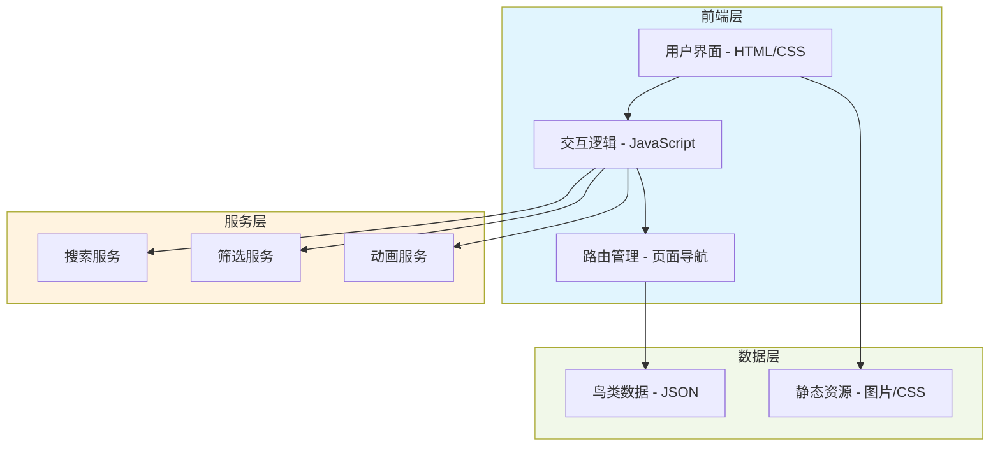
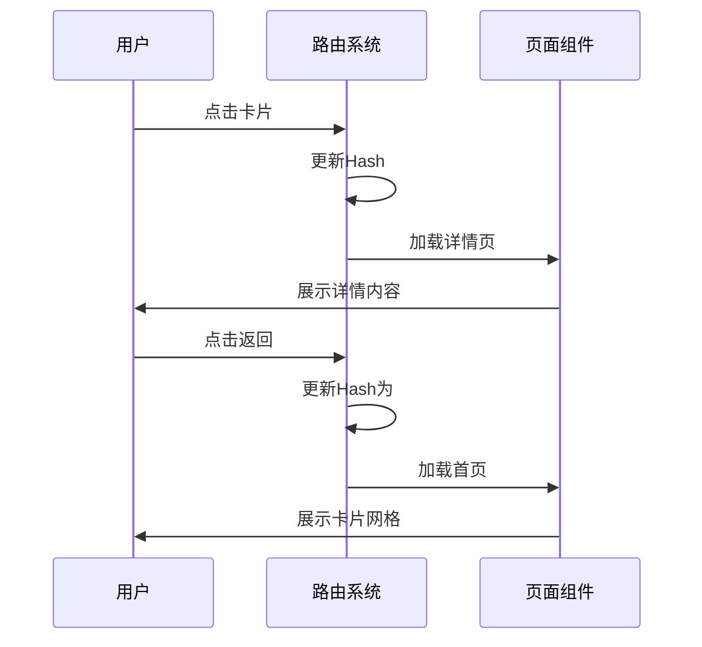

# 城市鸟类科普网页 - 技术架构文档

## 1. 架构设计

### 1.1 系统架构图



### 1.2 技术选型理由

**选择纯HTML/CSS/JavaScript的原因：**
- 轻量级，无需构建工具
- 快速加载和渲染
- 易于部署和维护
- 对科普展示场景足够高效
- 避免不必要的复杂性

**为什么不使用React/Vue：**
- 项目规模较小，页面数量少
- 无需复杂状态管理
- SEO要求不高（单页面应用）
- 加快首屏加载速度

## 2. 技术栈描述

### 2.1 前端技术

- **HTML5**：语义化标记结构
- **CSS3**：
  - CSS Grid：卡片网格布局
  - Flexbox：组件内部布局
  - CSS Variables：主题色彩管理
  - CSS Animations：过渡和动画效果
  - Media Queries：响应式设计
- **Vanilla JavaScript (ES6+)**：
  - 原生DOM操作
  - 事件委托
  - 模块化代码组织
  - 路由管理（Hash Router）
- **Google Fonts**：
  - Noto Serif SC：标题字体
  - Noto Sans SC：正文字体

### 2.2 外部资源

- **Font Awesome** 或 **Lucide Icons**：图标库
- **Unsplash API**：高质量鸟类图片（使用placeholder图片作为演示）
- **GitHub Pages** 或任意静态托管服务：部署

### 2.3 工具链

- **开发工具**：VS Code
- **浏览器**：Chrome DevTools（调试）
- **版本控制**：Git

## 3. 路由定义

### 3.1 页面路由

由于使用纯HTML实现，采用Hash路由实现SPA效果：

| 路由 | 页面 | 功能描述 |
|------|------|----------|
| `#/` | 首页 | 鸟类卡片网格展示 |
| `#/bird/:id` | 详情页 | 单个鸟类科普详情 |
| `#/search?q=` | 搜索结果 | 搜索关键词结果 |
| `#/category/:type` | 分类页 | 按分类筛选结果 |

### 3.2 路由转换流程



## 4. 数据结构

### 4.1 鸟类数据模型

```javascript
// 鸟类数据结构
{
  id: "sparrow",
  name: "麻雀",
  englishName: "Eurasian Tree Sparrow",
  latinName: "Passer montanus",
  category: "garden",  // 栖息环境
  diet: "杂食性",       // 食性
  size: "14-15cm",     // 体长
  description: "...",
  features: ["棕褐色羽毛", "圆锥形喙", "脸颊黑色斑点"],
  habitat: ["城市公园", "庭院", "农田"],
  distribution: "欧亚大陆广泛分布",
  habits: {
    diet: "种子、昆虫",
    breeding: "3-7月繁殖，窝卵数4-6枚",
    behavior: "群居性，常在地面跳跃觅食"
  },
  funFacts: [
    "麻雀是中国最常见的鸟类之一",
    "曾经被列为"四害"之一，现已平反"
  ],
  conservation: "无危（LC）",
  images: {
    main: "url",
    gallery: ["url1", "url2"]
  }
}
```

### 4.2 分类数据

```javascript
// 分类定义
const categories = [
  { id: "garden", name: "园林鸟类", icon: "🏡" },
  { id: "wetland", name: "湿地鸟类", icon: "🌊" },
  { id: "rooftop", name: "屋顶鸟类", icon: "🏠" },
  { id: "forest", name: "林地鸟类", icon: "🌲" },
  { id: "waterside", name: "水边鸟类", icon: "🦆" }
];

// 食性分类
const diets = [
  { id: "herbivore", name: "植食性", color: "#4CAF50" },
  { id: "carnivore", name: "肉食性", color: "#F44336" },
  { id: "omnivore", name: "杂食性", color: "#FF9800" },
  { id: "insectivore", name: "食虫性", color: "#2196F3" }
];
```

### 4.3 用户交互数据

```javascript
// 搜索历史（localStorage）
{
  recentSearches: ["麻雀", "鸽子"],
  lastVisit: "2024-01-01",
  favoriteBirds: ["sparrow", "swallow"]
}
```

## 5. 文件结构

```
e:\TRAE\chewchew\
│
├── index.html              # 主入口页面
├── bird-detail.html        # 详情页模板（可与index合并）
│
├── css/
│   ├── styles.css          # 主样式文件
│   ├── variables.css       # CSS变量定义
│   ├── animations.css      # 动画效果
│   └── responsive.css      # 响应式样式
│
├── js/
│   ├── app.js              # 主应用逻辑
│   ├── router.js           # 路由管理
│   ├── data.js             # 鸟类数据
│   ├── ui.js               # UI组件渲染
│   └── utils.js            # 工具函数
│
├── assets/
│   ├── images/             # 鸟类图片
│   └── icons/             # 图标资源
│
├── documents/
│   ├── PRD-城市鸟类科普.md
│   └── 技术架构文档.md
│
└── README.md               # 项目说明（可选）
```

## 6. 核心模块设计

### 6.1 路由模块 (router.js)

**职责：**
- 管理URL和页面状态的映射
- 处理浏览器前进/后退
- 页面切换动画控制

**API设计：**
```javascript
class Router {
  constructor() {
    this.routes = {};
    this.currentRoute = null;
  }
  
  addRoute(path, handler) {}
  navigateTo(path) {}
  handleRoute() {}
  init() {}
}
```

### 6.2 UI渲染模块 (ui.js)

**职责：**
- 渲染鸟类卡片
- 渲染详情页面
- 管理筛选和搜索UI
- 处理用户交互

**主要函数：**
```javascript
function renderBirdCard(bird) {}
function renderBirdDetail(bird) {}
function renderFilterBar(categories) {}
function renderSearchBar() {}
function showLoading() {}
function hideLoading() {}
```

### 6.3 数据管理模块 (data.js)

**职责：**
- 存储鸟类数据
- 提供数据查询接口
- 管理筛选和搜索逻辑

**主要函数：**
```javascript
function getAllBirds() {}
function getBirdById(id) {}
function searchBirds(query) {}
function filterBirdsByCategory(category) {}
function filterBirdsByDiet(diet) {}
```

### 6.4 工具模块 (utils.js)

**职责：**
- 通用工具函数
- DOM操作辅助
- 格式化函数

**主要函数：**
```javascript
function $(selector) {}
function $$(selector) {}
function debounce(fn, delay) {}
function throttle(fn, delay) {}
function formatDate(date) {}
function copyToClipboard(text) {}
function smoothScrollTo(element) {}
```

## 7. 页面性能优化

### 7.1 图片优化
- 使用`loading="lazy"`延迟加载
- 图片使用适当尺寸（响应式）
- 提供WebP格式作为备选
- 使用CSS `aspect-ratio`避免布局偏移

### 7.2 JavaScript优化
- 事件委托减少事件监听器
- 防抖/节流搜索输入
- 按需加载（非关键代码懒加载）
- 使用DocumentFragment批量DOM操作

### 7.3 CSS优化
- CSS动画使用`transform`和`opacity`（GPU加速）
- 避免复杂的选择器
- 合并重复样式
- 使用CSS containment隔离重排

### 7.4 首屏优化
- 内联关键CSS
- 骨架屏加载体验
- 预加载关键资源
- 最小化HTML大小

## 8. 可访问性设计

### 8.1 语义化HTML
- 正确使用`<header>`, `<main>`, `<nav>`, `<article>`, `<section>`
- 使用`<button>`处理可点击元素
- 图片提供有意义的alt属性

### 8.2 键盘导航
- Tab键导航可交互元素
- Enter键触发操作
- Escape键关闭模态/详情
- 焦点状态清晰可见

### 8.3 ARIA标签
```html
<nav aria-label="主导航">
<button aria-label="返回首页">
<div role="search" aria-label="搜索">
<ul role="list" aria-label="鸟类列表">
```

### 8.4 屏幕阅读器支持
- 跳过导航链接
- 面包屑导航
- 实时区域更新通知
- 进度指示器

## 9. 浏览器兼容性

### 9.1 支持的浏览器
- Chrome 90+
- Firefox 88+
- Safari 14+
- Edge 90+
- 移动端Safari和Chrome

### 9.2 CSS兼容性
- 使用Autoprefixer处理前缀
- 提供优雅降级
- 避免实验性CSS特性
- 使用广泛支持的CSS特性

## 10. 部署方案

### 10.1 部署平台选择
- **GitHub Pages**：免费、简单（推荐）
- **Vercel**：免费、自动部署
- **Netlify**：免费、CDN加速
- **传统虚拟主机**：FTP上传

### 10.2 部署流程
1. 本地测试完成
2. Git提交代码
3. 推送到GitHub仓库
4. 在GitHub Pages启用部署
5. 等待自动部署完成
6. 访问上线地址验证

### 10.3 自定义域名（可选）
- 购买域名
- DNS解析到部署平台
- 配置SSL证书
- 强制HTTPS重定向

## 11. 开发规范

### 11.1 代码风格
- 缩进：2空格（HTML/JS）、4空格（CSS）
- 命名：camelCase（JS变量函数）、kebab-case（CSS类名）
- 注释：JSDoc风格（JS）、HTML注释（HTML）
- 格式化：Prettier自动格式化

### 11.2 Git提交规范
```
feat: 添加新功能
fix: 修复bug
style: 代码样式调整
refactor: 重构代码
docs: 文档更新
```

### 11.3 测试清单
- [ ] 所有页面正常加载
- [ ] 卡片点击跳转正常
- [ ] 搜索功能正常
- [ ] 筛选功能正常
- [ ] 响应式布局正常
- [ ] 动画流畅无卡顿
- [ ] 图片正常显示
- [ ] 键盘导航正常
- [ ] 无控制台错误
